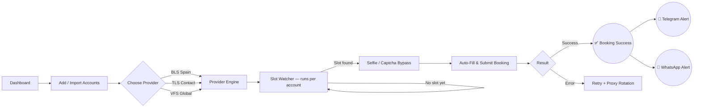
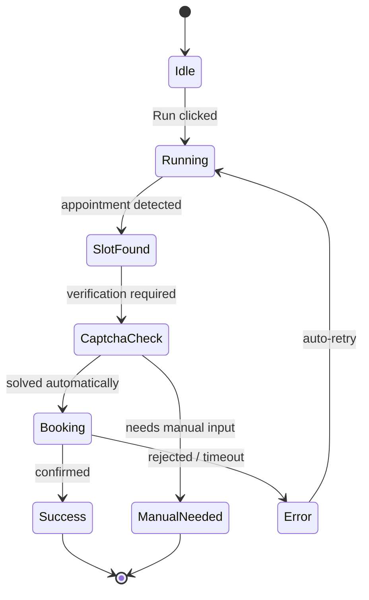

<div align="center">


<br/>


<br/><br/>


<br/>


</div>

<br/>

## 🧭 What is Booking Auto Bot?

**Booking Auto Bot** is a desktop automation engine that watches visa & appointment providers around the clock, detects available slots the moment they open, and books them automatically — across **multiple accounts, multiple providers, and multiple countries at the same time.**

The moment a slot is found or a booking is confirmed, you get notified **instantly on Telegram and WhatsApp** — no need to keep the app open and stare at the screen.

<br/>

## ⚡ Core Features

| | Feature | Description |
|---|---|---|
| 🟢 | **Automatic Booking Engine** | Continuously watches provider sites and books available slots the second they appear. |
| 👥 | **Multi-Account System** | Manage unlimited accounts with per-account credentials, region, category, and provider — import them in bulk via CSV. |
| 🌐 | **Multi-Provider Support** | Native support for **BLS Spain**, **TLS Contact**, and **VFS Global**, with more providers on the roadmap. |
| 🛰️ | **Proxy Rotation** | Route traffic per account through rotating proxies to stay resilient and avoid rate-limits. |
| 🤳 | **Selfie / Captcha Bypass** | Handles identity-verification and captcha checkpoints automatically during the booking flow. |
| 🔔 | **Real-Time Notifications** | Get pinged the instant a slot is found, a booking succeeds, or a captcha needs manual input — via Telegram and WhatsApp. |
| 📊 | **Live Dashboard** | See successful runs, errors, active runs, and total accounts at a glance. |
| 📜 | **Logs & Activity History** | Full run history for every account, so you always know what happened and when. |
| 🔐 | **License Activation** | Simple activation flow with subscription status built right into Settings. |

<br/>

## 🖥️ Tech Stack

<div align="center">


</div>

<br/>

## 🗺️ How It Works





<br/>

## 📦 Download

<div align="center">

[]([https://github.com/YOUR-USERNAME/booking-auto-bot/releases/latest](https://onlineunknowns.github.io/AutoBooking/))
[]()

</div>

1. Go to the [**Releases**](https://onlineunknowns.github.io/AutoBooking/) page.
2. Download the latest `BookingAutoBot-win-x64.zip`.
3. Extract it anywhere and run `Booking Auto Bot.exe` — no installation required.

<br/>

## 🚀 Getting Started

```text
1. Launch the app.
2. Go to "Accounts" → Add Account (or Import CSV for bulk accounts).
3. Pick a Provider (BLS Spain / TLS Contact / VFS Global), a country, and a category.
4. Go to "Notifications" → paste your Telegram Bot Token + Chat ID → Save.
5. Hit "Run" on any account (or run several at once) and let the bot watch for you.
```

<details>
<summary><b>🔔 Setting up Telegram notifications</b></summary>
<br/>

1. Open Telegram and message **[@BotFather](https://t.me/BotFather)** → `/newbot` → copy the token it gives you.
2. Paste that token into **Notifications → Telegram Bot Token**.
3. Message your new bot once, then get your **Chat ID** (via [@userinfobot](https://t.me/userinfobot) or a group/channel ID).
4. Paste it into **Telegram Chat ID**, click **Send Test Alert** to confirm, then **Save**.

</details>

<br/>
</div>

<br/>

## ⚠️ Disclaimer

This tool automates interactions with third-party appointment/visa provider websites. You are responsible for using it in accordance with the target provider's terms of service and any applicable local regulations. The developer is not responsible for accounts suspended, appointments lost, or any consequence resulting from misuse.

<br/>

## 📬 Connect

<div align="center">

<a href="https://wa.me/201286669272"></a>
<a href="https://t.me/IQROUTER"></a>

</div>

<br/>

<div align="center">

<sub>Made with ⚙️ automation, ☕ patience, and a lot of retries.</sub>
</div>
